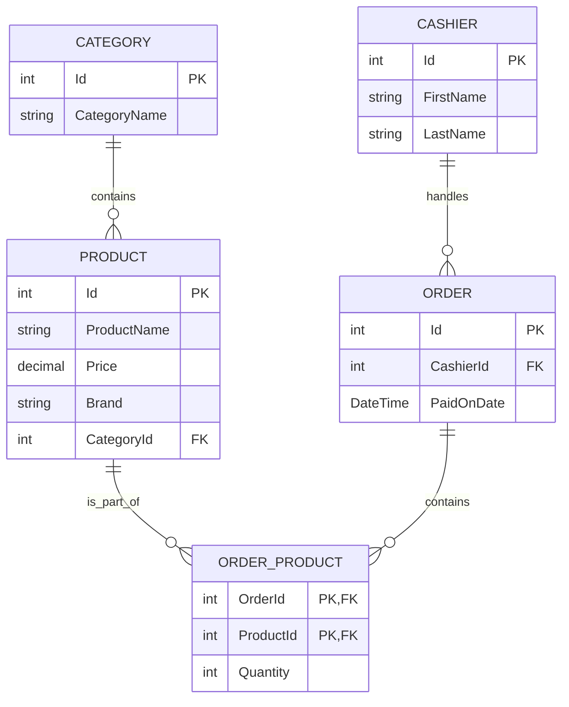

# Entity Relationship Diagram

## Tables and Keys

| Table         | Primary Key(s)         | Foreign Key(s)                                     |
| ------------- | ---------------------- | -------------------------------------------------- |
| Cashiers      | `Id`                   | —                                                  |
| Categories    | `Id`                   | —                                                  |
| Products      | `Id`                   | `CategoryId → Categories(Id)`                      |
| Orders        | `Id`                   | `CashierId → Cashiers(Id)`                         |
| OrderProducts | `OrderId`, `ProductId` | `OrderId → Orders(Id)`, `ProductId → Products(Id)` |

